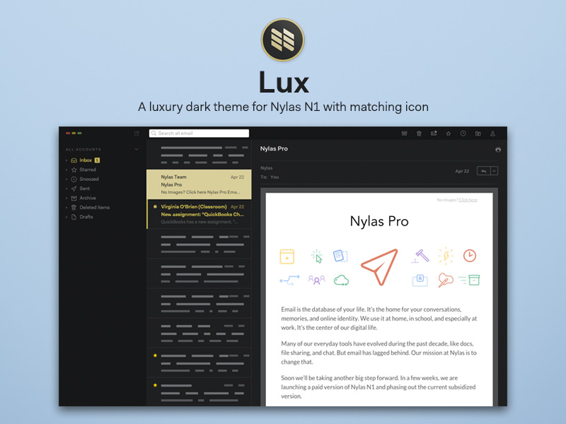
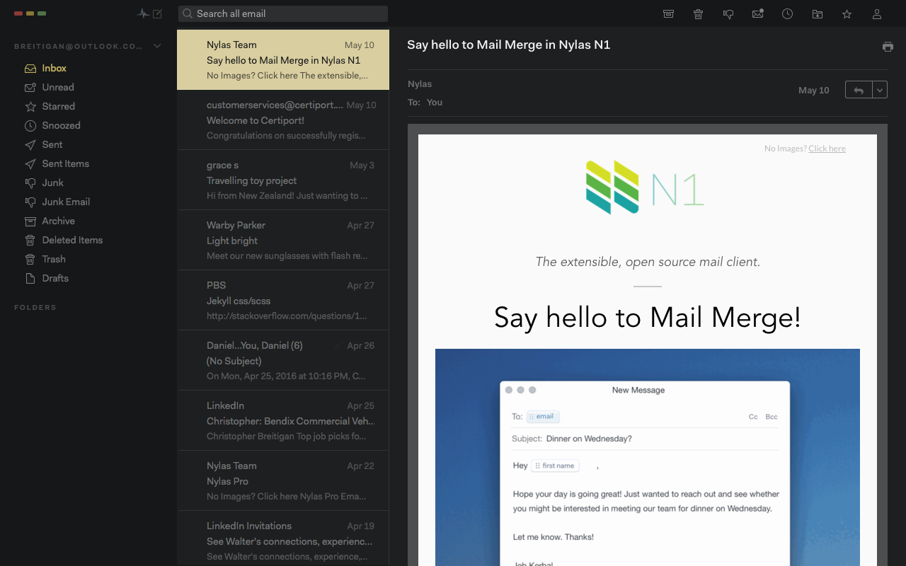
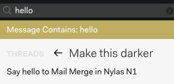

# Lux - N1 Theme

Lux is a dark UI theme for the Nylas N1 email client. It is built on top of Jamie Wilson's [Darkside theme](http://jamiewilson.io/darkside).

This version is currently working and stable but is still considered a 'work in progress' and there is a lot of room for improvement.
This theme uses dark background colors with a 'gold' accent color to provide a 'luxurious' look and feel.

If you find any bugs, or wish to contribute, please feel free to open an issue or pull-request.

## Installation
1. Download/clone this repo
2. Nlyas N1 > Install theme
3. Double click the folder

## To-Do List
1. Refactor and organize codebase
2. Make text lighter in emails that are plain text (currently using a lighter background to work around this but this is not ideal)
3. Change search headings color 
4. Include styles for notifications
5. Other misc small tweaks.

## Thanks!
I hope you enjoy Lux.
